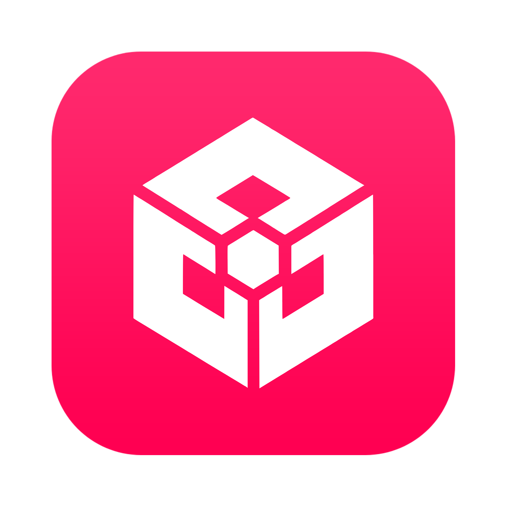

**MONOCADE**

Created by Lloyd J Howarth

[Overview](#overview) •
[Platforms](#platforms) •
[Dependencies](#dependencies) •
[License](#license)

<h2 id="overview">🔍 Overview</h2>

Monocade is an all-in-one game engine designed for complete beginners

> Do not use this branch for development

Getting started...

* 🌐 1. Clone the official repository: `git clone https://github.com/Monocade/Engine.git`
* 📂 2. Build '**Monocade.sln**' in your favourite IDE such as [Rider](https://www.jetbrains.com/rider) or [Visual Studio](https://visualstudio.microsoft.com)
* 🚀 3. Run the editor application
* 🎮 4. Build & launch your game

<h2 id="platforms">🖥️ Cross-platform</h2>

Currently supports these platforms:
* **Windows:** Windows 10+
* **MacOS:** Ventura 13.0+
* **Linux:** Ubuntu 22.04+

<h2 id="dependencies">📦 Dependencies</h2>

Currently using these dependencies:
* [DOTNET 10.0.103](https://github.com/dotnet/runtime)
* [IMGUI 1.92.6](https://github.com/ocornut/imgui)
* [OPENGL 3.3](https://www.opengl.org)
* [JITTER 2.7.9](https://github.com/notgiven688/jitterphysics2)
* [SDL 3.4.2](https://github.com/libsdl-org/SDL)

<h2 id="license">📄 License</h2>

* This project is proprietary and not licensed for public use.
* You can view the license [here](License.txt).

 
